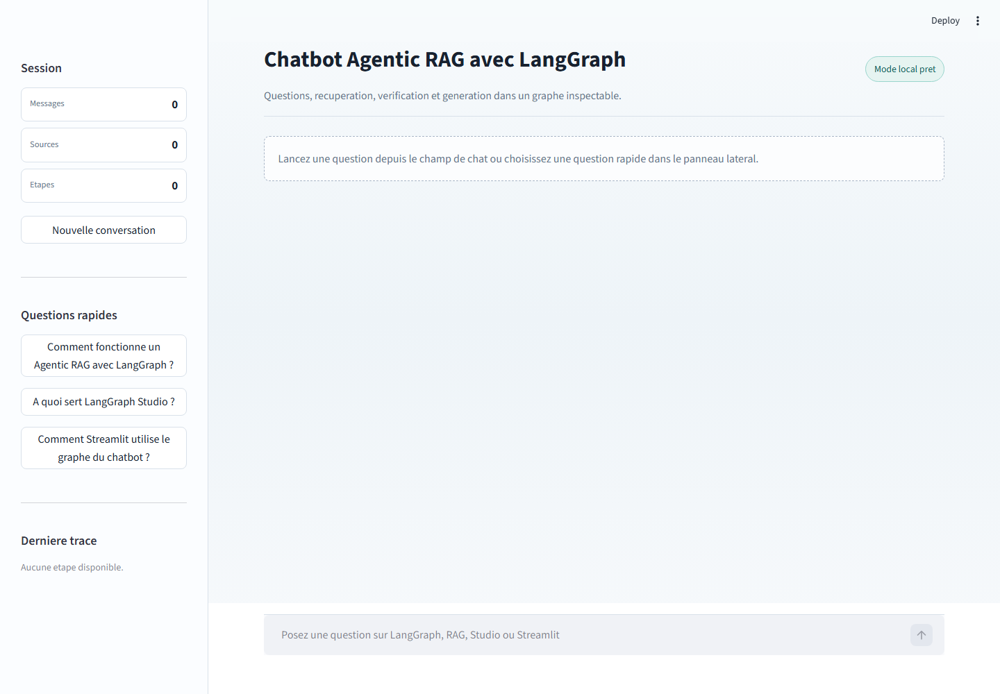
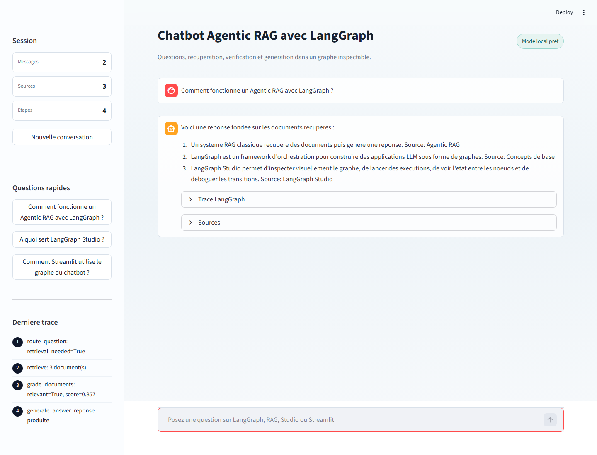
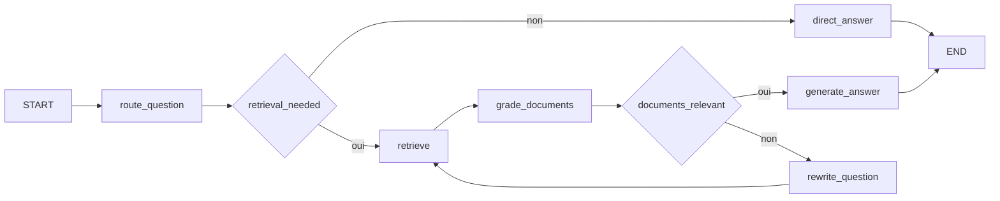

# LangGraph Agentic RAG Chatbot

Application pédagogique en deux parties pour pratiquer LangGraph :

- une démonstration des concepts fondamentaux de LangGraph ;
- un chatbot Agentic RAG avec interface Streamlit et support LangGraph Studio.

Le projet fonctionne avec une clé OpenAI valide, mais il reste testable sans clé grâce à un mode local extractif basé sur les documents retrouvés.

## Aperçu





## Fonctionnalités

- Graphe LangGraph simple pour illustrer `StateGraph`, `START`, `END`, les noeuds et les arêtes conditionnelles.
- Agentic RAG découpé en étapes explicites : routage, retrieval, évaluation de pertinence, reformulation et génération.
- Base de connaissances locale en Markdown.
- Fallback local si aucune clé OpenAI n’est configurée ou si l’appel LLM échoue.
- Interface Streamlit avec historique, questions rapides, sources et trace LangGraph.
- Configuration `langgraph.json` prête pour LangGraph Studio.

## Architecture

```text
.
├── langgraph.json
├── streamlit_app.py
├── requirements.txt
├── pyproject.toml
├── docs/
│   └── screenshots/
│       ├── streamlit-home.png
│       └── streamlit-chat.png
└── langgraph_rag/
    ├── agent.py
    ├── knowledge_base.md
    ├── retriever.py
    └── simple_graph.py
```

## Workflow Agentic RAG



## Prérequis

- Python 3.11 à 3.13 recommandé.
- Python 3.14 peut fonctionner, mais LangChain peut afficher un avertissement Pydantic.
- Une clé `OPENAI_API_KEY` est optionnelle pour tester le projet.

## Installation

```powershell
python -m venv .venv
.\.venv\Scripts\Activate.ps1
pip install -r requirements.txt
Copy-Item .env.example .env
```

Pour activer les réponses générées par LLM, renseigner `.env` :

```env
OPENAI_API_KEY=sk-...
OPENAI_MODEL=gpt-4.1-mini
LANGSMITH_TRACING=false
```

Sans clé valide, le chatbot utilise automatiquement une réponse extractive à partir des sources récupérées.

## Partie 1 - Concepts LangGraph

Lancer la démonstration de base :

```powershell
python -m langgraph_rag.simple_graph
```

Cette partie montre :

- la déclaration d’un état partagé avec `StateGraph` ;
- l’exécution de noeuds Python ;
- la mise à jour progressive de l’état ;
- le choix dynamique d’une branche avec une arête conditionnelle.

## Partie 2 - Chatbot Agentic RAG

Lancer l’interface web :

```powershell
streamlit run streamlit_app.py
```

Puis ouvrir :

```text
http://localhost:8501
```

Exemples de questions :

- `Comment fonctionne un Agentic RAG avec LangGraph ?`
- `A quoi sert LangGraph Studio ?`
- `Comment Streamlit utilise le graphe du chatbot ?`

## LangGraph Studio

Valider la configuration :

```powershell
langgraph validate
```

Démarrer le serveur de développement :

```powershell
langgraph dev
```

Le serveur local expose les graphes sur :

```text
http://127.0.0.1:2024
```

Graphes disponibles :

- `basic_demo` : démonstration des concepts de base ;
- `agentic_rag` : chatbot Agentic RAG.

Exemple d’entrée pour `agentic_rag` :

```json
{
  "question": "Comment LangGraph gere les noeuds et les aretes conditionnelles ?"
}
```

### Note Windows

Si la commande `langgraph` n’est pas reconnue, ajouter le dossier Scripts de Python au `PATH` ou appeler l’exécutable directement :

```powershell
$env:PYTHONIOENCODING = "utf-8"
& "$env:APPDATA\Python\Python314\Scripts\langgraph.exe" dev
```

## Validation

Commandes utilisées pour vérifier le projet :

```powershell
python -m compileall langgraph_rag streamlit_app.py
langgraph validate
python -m langgraph_rag.simple_graph
python -m langgraph_rag.agent
```

## Fichiers principaux

- `langgraph_rag/simple_graph.py` : graphe minimal pour apprendre les bases.
- `langgraph_rag/agent.py` : graphe Agentic RAG complet.
- `langgraph_rag/retriever.py` : retrieval local par similarité lexicale.
- `langgraph_rag/knowledge_base.md` : base documentaire utilisée par le RAG.
- `streamlit_app.py` : interface web du chatbot.
- `langgraph.json` : déclaration des graphes pour LangGraph Studio.
